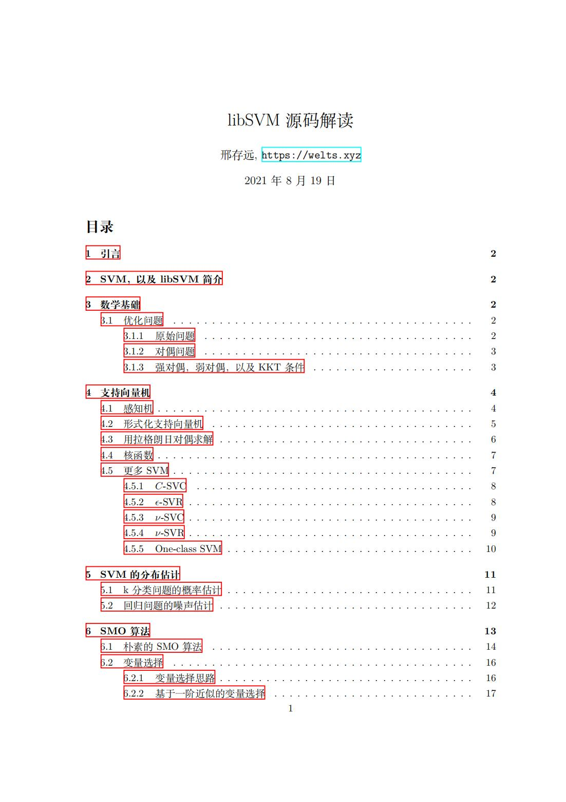
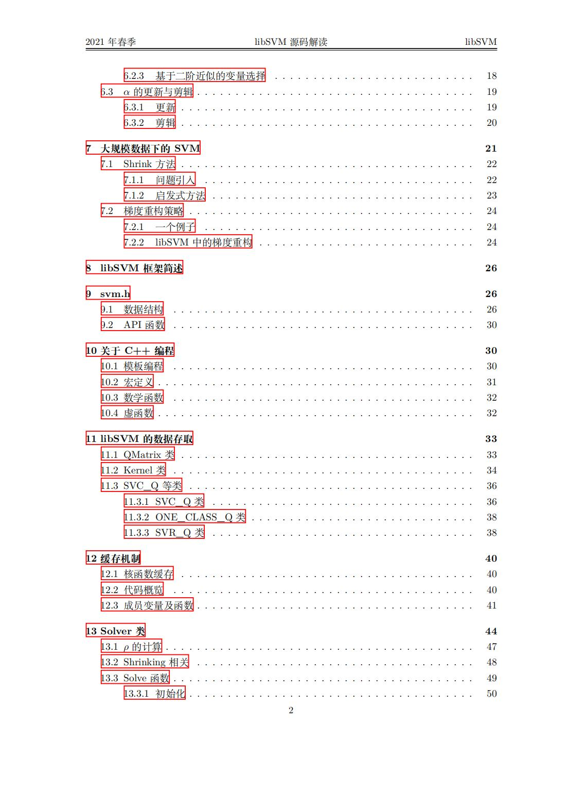
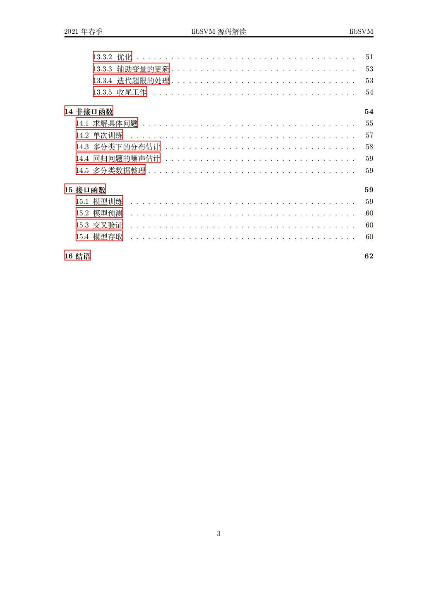

## 引言

早在学习SVM时，笔者便有亲手实现一个SVM的想法。后来发现其实现难度与数学技巧远高于单隐层神经网络，这对于只能写出一个二分类感知机的我不亚于小学生做高考题。在老师的建议下，笔者决定去阅读当前最流行的SVM代码库：libSVM和libLinear的源代码，不仅是学习SVM怎么写，也是学习一个合格的代码框架应该如何去设计。在此之前，笔者已经对SVM的SMO算法和实现技巧进行了一些零散的了解，这里打算将它们串联起来，同时为阅读源码提供一定的数学基础。

## 预览





## SVM和libSVM

[支持向量机](https://en.wikipedia.org/wiki/Support-vector_machine)(SVM, Support Vector Machine)属于一种线性分类器，是建立在统计学习理论的VC维理论和结构风险最小原理的基础上，根据有限的训练集，在模型的复杂性和学习性之间寻求最佳的折中，以获得最好的泛化能力的经典分类方法。

[libSVM](https://www.csie.ntu.edu.tw/~cjlin/libsvm/)是由国立台湾大学的林智仁教授等开发的一款利用支持向量机用于分类、回归和区间估计等机器学习任务的多语言（C++、Java、Python、MATLAB等）、跨平台（Windows、Linux、mac OS）的集成化软件，最新版本为Version 3.25。

## libSVM

这一部分主要讨论libSVM相关，包括算法和实现。

### SVM种类

在libSVM中共涉及到5类支持向量机，分别用于回归，分类和分布估计等任务。笔者已经对其进行总结：

[支持向量机 - 种类汇总](https://welts.xyz/2021/07/11/svm-class/)

libSVM其实是一个面向求解带约束的二次规划问题的软件包，里面所有的算法全部是围绕优化问题展开。笔者在《机器学习导论》等课程中并没有接触到分布估计任务，因此也将《[LIBSVM: A Library for Support Vector Machines](https://www.csie.ntu.edu.tw/~cjlin/papers/libsvm.pdf)》中这一部分进行了分析：[SVM的分布估计](https://welts.xyz/2021/07/12/dist_esti/)。

### SMO算法

SMO（Sequential Minimal Optimization）是求解SVM问题的高效算法之一，libSVM采用的正是该算法。SMO算法其实是一种启发式算法：先选择两个变量$α_i$和$α_j$，然后固定其他参数，从而将问题转化成一个二变量的二次规划问题。求出能使目标最大的一对$α_i$和$α_j$后，将它们固定，再选择两个变量，直到目标值收敛。

笔者在[SMO算法 - 计算方法]([SMO算法 - 邢存远的博客 | Welt Xing's Blog (welts.xyz)](https://welts.xyz/2021/07/09/smo/))中计算出，在选定$i$和$j$后，$\alpha_i$和$\alpha_j$满足下面的更新公式：

$$
\begin{cases}
\alpha_i^\text{new}=\dfrac{y_i}{\eta}(E_j-E_i)+\alpha_i^\text{old}\\
\alpha_j^\text{new}=\dfrac{y_j}{\eta}(E_i-E_j)+\alpha_j^\text{old}
\end{cases}
$$

其中$\eta=K_{11}-2K_{12}+K_{22}$，$E_i=f(x_i)-y_i$。但我们这里并没有考虑$\alpha_i$的约束边界，也就是$[0,C]$。同时我们也可以发现如何选择$i$和$j$会影响学习效率。

#### SMO算法的变量选择（WSS）

《统计学习方法》中提出分别通过“违反KKT条件程度”和“误差最大化”准则来选择$i$和$j$。而在《[Working Set Selection Using Second Order Information for Training Support Vector Machines](https://www.jmlr.org/papers/volume6/fan05a/fan05a.pdf)》提出了多种具体的选择i和j（标准的称呼是工作集）的算法。libSVM在选择第一个工作集元素（也就是$i$）时采用了“基于一阶近似的变量选择”；在选择第二个工作集元素时采用了“基于一阶近似的变量选择”。这一算法并不是论文中最复杂的选取方法，可能是工程实现方面的考虑。

笔者在[SMO算法 - 变量选择问题](https://welts.xyz/2021/07/10/wss/)中具体推导了上面提到的几种算法。

#### libSVM中的变量选择

实际在libSVM中的变量选择远没有上面那么简单，因为即使进行了参数迭代，还需要考虑其是否越界，由此引入剪辑（Clipping），类似一个线性规划问题。笔者在[LIBSVM中的SMO算法](https://welts.xyz/2021/07/11/libsmo/)中论述了剪辑操作的原因和方法，同时证明了《统计学习方法》和《[LIBSVM: A Library for Support Vector Machines](https://www.csie.ntu.edu.tw/~cjlin/papers/libsvm.pdf)》中参数更新公式是等价的。

#### 应用于大规模数据的SVM

Thorsten Joachims，也是支持向量机软件包SVM-Light的作者，在《[Making large-scale SVM learning practical ](https://www.econstor.eu/bitstream/10419/77178/2/1998-28.pdf)》中提出在面对大规模数据时提高SVM训练效率的方案：

- 更有效和更高效的变量选择法；
- 不断地“收缩”问题规模；
- 计算上的改进：比如缓存机制的引入和梯度的增量式更新。

libSVM将这三点完全考虑进来。我们前面已经提到了变量选择；至于收缩问题规模，得益于SVM解的稀疏性：

1. 支持向量个数比样本数少得多；
2. 许多支持向量对应的$\alpha_i=C$.

关于收缩，我们在[SVM的Shrink技巧](https://welts.xyz/2021/07/12/shrink/)进行了进一步讨论。

缓存机制则是libSVM的另一个提升计算效率的一个手段：由于我们会频繁用到核函数的值，考虑到数据存取的时间局部性，libSVM用一个双向循环链表来存取数据，并基于最近最少用（LRU）的原则对其进行数据更新。在[libSVM的Caching](https://welts.xyz/2021/07/12/cache/)中，我们对相关源码进行了解释。由于LRU是最古老，应用最广泛的的一种淘汰算法，因此能看到不少基于Caching的改进策略被提出，比如《An Improved Caching Strategy for Training SVMs》。

最后一个想法是梯度的增量式更新，思想很简单，如果我们的任务是对变量`a`进行加1运算，我们更愿意这样（假设此时`a`为10）：

```cpp
a++
```

而不是重新计算：

```cpp
a = 10 + 1
```

我们在[梯度重构](https://welts.xyz/2021/07/13/grad_recon/)中讨论了这一想法在SVM中的运用，同时加入libSVM的源码进行讲解。

## libSVM的代码结构

libSVM总体由头文件`svm.h`和源文件`svm.cpp`构成，我们按照这样的结构对代码进行解读。


#### svm.h相关

我们在[libSVM源码解读 - svm.h](https://welts.xyz/2021/07/13/libsvm1/)中简述了libSVM中数据结构的定义和接口函数的声明，同时也对libSVM的逻辑结构进行简单分析。

#### svm.cpp相关

在svm.cpp中，我们首先对所需的C++相关知识做出了整理，包括模板，多态等，收集在[libSVM源码解读（2）](https://welts.xyz/2021/07/14/libsvm2/)中。扫清语言障碍后，我们便可以阅读算法代码。

我们接着从libSVM的数据存储，尤其是矩阵存储方面入手，对相关的几个类进行了分析：[libSVM源码解读（3）](https://welts.xyz/2021/07/14/libsvm3/)。

接着是从上图的逻辑结构底层出发，仔细研究了Solver类的实现：[libSVM源码解读（4）](https://welts.xyz/2021/07/15/libsvm4/)。libSVM中还有个Solver_NU类，是用来求解$\nu$-SVC和$\nu$-SVR问题的基类，我们不做过多介绍。

在往上，我们在[libSVM源码解读（5）](https://welts.xyz/2021/07/15/libsvm5/)中介绍了基础的Solver上面的算法一些函数，比如特定的训练函数；

最后我们对libSVM中最上层的接口函数在[libSVM源码解读（6）](https://welts.xyz/2021/07/15/libsvm6/)中进行总结，至此完成了libSVM的源码解读。

我们将上面零碎的知识整理成pdf。
