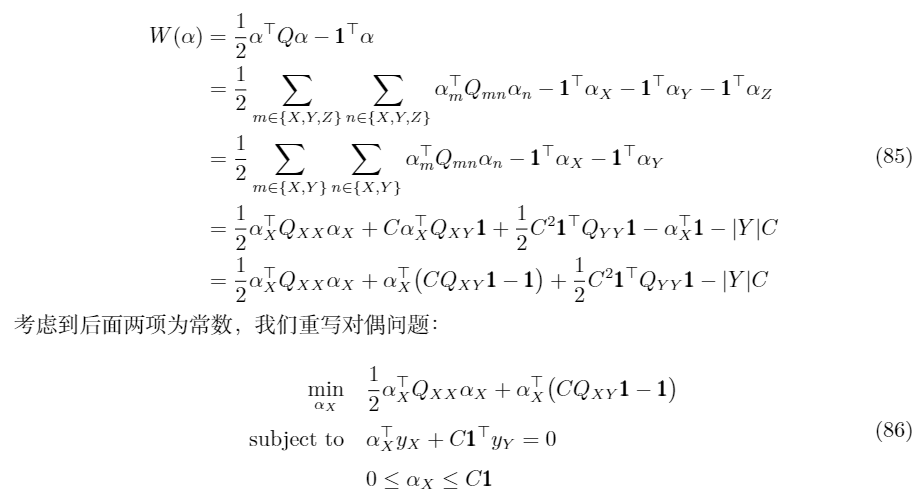

# 原文校正与补充

起因：丢失了libsvm.pdf对应的tex文件，无法再对原文进行大幅度编辑，在此进行校正与补充。您可以通过issue或邮件提出问题或修改意见。

## 如何用SMO算法解决回归问题

见<https://welts.xyz/2021/09/16/svr/>.

## Shrink方法中的公式错误

在libsvm的shrinking方法中（P25），公式编辑错误，(85)式和(86)式应为：



## 关于单分类SVM

可参考<https://welts.xyz/2021/09/25/one_class_svm/>.

## svm-toy的使用

在libsvm主文件夹的windows文件夹中，有一个`svm.toy.exe`文件，用于在Windows系统上提供一个SVM的简易示范，它应该是用`svm-toy\windows\svm-toy.cpp`编译而成。其画面是这样的：


用鼠标在界面上点击，形成点集，“Change”表示换成另外一个类的数据集，“Run”是运行libsvm对点集进行分类回归或异常检测，”Clear“，”Save“和”Load“分别是清空、保存和加载，最后一个文本框是可输入的，默认字符串是"-t 2 -c 100"，我们也可以对其进行修改，以进行除了分类以外其他任务：参数的定义与设置规则可见于`svm_train.cpp`中：

```cpp
void exit_with_help() {
    printf(
        "Usage: svm-train [options] training_set_file [model_file]\n"
        "options:\n"
        "-s svm_type : set type of SVM (default 0)\n"
        "	0 -- C-SVC		(multi-class classification)\n"
        "	1 -- nu-SVC		(multi-class classification)\n"
        "	2 -- one-class SVM\n"
        "	3 -- epsilon-SVR	(regression)\n"
        "	4 -- nu-SVR		(regression)\n"
        "-t kernel_type : set type of kernel function (default 2)\n"
        "	0 -- linear: u'*v\n"
        "	1 -- polynomial: (gamma*u'*v + coef0)^degree\n"
        "	2 -- radial basis function: exp(-gamma*|u-v|^2)\n"
        "	3 -- sigmoid: tanh(gamma*u'*v + coef0)\n"
        "	4 -- precomputed kernel (kernel values in training_set_file)\n"
        "-d degree : set degree in kernel function (default 3)\n"
        "-g gamma : set gamma in kernel function (default 1/num_features)\n"
        "-r coef0 : set coef0 in kernel function (default 0)\n"
        "-c cost : set the parameter C of C-SVC, epsilon-SVR, and nu-SVR "
        "(default 1)\n"
        "-n nu : set the parameter nu of nu-SVC, one-class SVM, and nu-SVR "
        "(default 0.5)\n"
        "-p epsilon : set the epsilon in loss function of epsilon-SVR (default "
        "0.1)\n"
        "-m cachesize : set cache memory size in MB (default 100)\n"
        "-e epsilon : set tolerance of termination criterion (default 0.001)\n"
        "-h shrinking : whether to use the shrinking heuristics, 0 or 1 "
        "(default 1)\n"
        "-b probability_estimates : whether to train a SVC or SVR model for "
        "probability estimates, 0 or 1 (default 0)\n"
        "-wi weight : set the parameter C of class i to weight*C, for C-SVC "
        "(default 1)\n"
        "-v n: n-fold cross validation mode\n"
        "-q : quiet mode (no outputs)\n");
    exit(1);
}
```

举个例子，假设我们想用One Class SVM进行一个分布估计任务，我们就可以将参数修改为：

```text
-s 2 -t 2 -n 0.5 -b
```

也就是用One Class SVM(-s 2)，核函数为RBF核(-t 2)，参数nu设置为0.5(-n 0.5)，进行分布估计任务(-b)，结果如下：


形成的是圆形决策边界。
